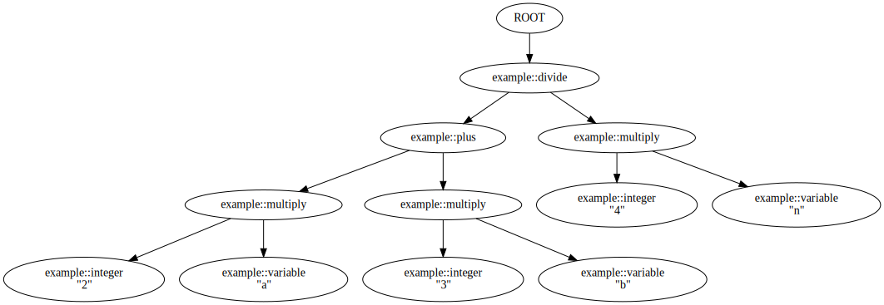

# Contrib and Examples

The PEGTL includes several parts that go beyond the core library functionality.

They are included both for convenience and to show how certain things can be done with the PEGTL.

## Notice

All feedback is highly welcome, in particular whether more sub-rules to serve as attachment points for actions are required.

Similarly, if you have written a grammar with the PEGTL that might be generally useful, you are welcome to contribute it for inclusion in future versions.

For all questions and remarks contact us at **taocpp(at)icemx.net**.

## Contents

* [Contrib](#contrib)
* [Examples](#examples)

## Contrib

###### `<tao/pegtl/contrib/abnf.hpp>`

* Core ABNF rules according to [RFC 5234, Appendix B](https://tools.ietf.org/html/rfc5234).
* Ready for production use.

###### `<tao/pegtl/contrib/alphabet.hpp>`

* Constants for ASCII letters.
* Shortens `string<'f','o','o'>` to `string<f,o,o>`.
* Ready for production use.
* Superceeded by `TAO_PEGTL_STRING()`.

###### `<tao/pegtl/contrib/http.hpp>`

* HTTP 1.1 grammar according to [RFC 7230](https://tools.ietf.org/html/rfc7230).
* Has been used successfully but is still considered experimental.

###### `<tao/pegtl/contrib/integer.hpp>`

* Grammars and actions for PEGTL-input-to-integer conversions.

###### `<tao/pegtl/contrib/limit_depth.hpp>`

* Limits the nesting level of rules when parsing a grammar, prevents stack overflows.
* Can be applied selectively at specific rules to improve efficiency.
* See `src/test/pegtl/limit_depth.cpp`.

###### `<tao/pegtl/contrib/json.hpp>`

* JSON grammar according to [RFC 7159](https://tools.ietf.org/html/rfc7159) (for UTF-8 encoded JSON only).
* Ready for production use.

###### `<tao/pegtl/contrib/parse_tree.hpp>`

* See [Parse Tree](Parse-Tree.md).

###### `<tao/pegtl/contrib/raw_string.hpp>`

* Grammar rules to parse Lua-style long (or raw) string literals.
* Ready for production use.

###### `<tao/pegtl/contrib/rep_string.hpp>`

* Contains optimised version of `rep< N, string< Cs... > >`:
* Rule `ascii::rep_string< N, Cs... >`.

###### `<tao/pegtl/contrib/rep_one_min_max.hpp>`

* Contains optimised version of `rep_min_max< Min, Max, ascii::one< C > >`:
* Rule `ascii::rep_one_min_max< Min, Max, C >`.

###### `<tao/pegtl/contrib/separated_seq.hpp>`

* Allows to parse rules separated by a separator.
* Rule `separated_seq< S, A, B, C, D >` is equivalent to `seq< A, S, B, S, C, S, D >`.

###### `<tao/pegtl/contrib/to_string.hpp>`

Utility function `to_string<>()` that converts template classes with arbitrary sequences of characters as template arguments into a `std::string` that contains these characters.

###### `<tao/pegtl/contrib/trace.hpp>`

* See [Tracer](Getting-Started.md#tracer).

###### `<tao/pegtl/contrib/unescape.hpp>`

This file contains helpers to unescape JSON and C and similar escape sequences.

* Utility functions frequently needed to unescape escape-sequences.
* Action classes that perform unescaping of escape-sequences.

###### `<tao/pegtl/contrib/uri.hpp>`

* URI grammar according to [RFC 3986](https://tools.ietf.org/html/rfc3986).
* This is still experimental.

## Examples

###### `src/example/pegtl/abnf2pegtl.cpp`

Reads a file with an [ABNF (RFC 5234)](https://tools.ietf.org/html/rfc5234)-style grammar and converts it into corresponding PEGTL rules in C++. Some extensions and restrictions compared to RFC 5234:

* As we are defining PEGs, the alternations are now ordered (`sor<>`).
* The *and*- and *not*-predicates from PEGs have been added as `&` and `!`, respectively.
* A single LF is also accepted as line ending.
* C++ identifiers are formed by replacing the dashes in rulenames with underscores.
* Reserved identifiers (keywords, ...) are rejected.
* Numerical values must fit into the corresponding C++ data type.

###### `src/example/pegtl/analyze.cpp`

A small example that provokes the [grammar analysis](Grammar-Analysis.md) to find problems.

###### `src/example/pegtl/calculator.cpp`

A calculator with all binary operators from the C language that shows

* how to use stack-based actions to perform a calculation on-the-fly during the parsing run, and
* how to build a grammar with a run-time data structure for arbitrary binary operators with arbitrary precedence and associativity.

In addition to the binary operators, round brackets can be used to change the evaluation order. The implementation uses `long` integers as data type for all calculations.

```sh
$ build/src/example/pegtl/calculator "2 + 3 * -7"  "(2 + 3) * 7"
-19
35
```

In this example the grammar takes a bit of a second place behind the infrastructure for the actions required to actually evaluate the arithmetic expressions.
The basic approach is "shift-reduce", which is very close to a stack machine, which is a model often well suited to PEGTL grammar actions:
Some actions merely push something onto a stack, while other actions apply some functions to the objects on the stack, usually reducing its size.

###### `src/example/pegtl/chomsky_hierarchy.cpp`

Examples of grammars for regular, context-free, and context-sensitive languages.

###### `src/example/pegtl/csv1.cpp` and `src/example/pegtl/csv2.cpp`

Two simple examples for grammars that parse different kinds of CSV-style file formats.

###### `src/example/pegtl/hello_world.cpp`

Minimal parser-style "hello world" example from the [Getting Started](Getting-Started.md) page.

###### `src/example/pegtl/indent_aware.cpp`

Shows one approach to implementing an indentation-aware language with a very very small subset of Python.

###### `src/example/pegtl/json_parse.cpp`

Shows how to use the custom error messages defined in `json_errors.hpp` with the `<tao/pegtl/contrib/json.hpp>` grammar to parse command line arguments as JSON data.

###### `src/example/pegtl/json_build.cpp`

Extends on `json_parse.cpp` by parsing JSON files into generic JSON data structure.

###### `src/example/pegtl/json_count.cpp`

Shows how to use a simple custom control to create some parsing statistics while parsing JSON files.

###### `src/example/pegtl/lua53_parse.cpp`

Parses all files passed on the command line with a slightly experimental grammar that should correspond to the [Lua](http://www.lua.org/) 5.3 lexer and parser.

###### `src/example/pegtl/modulus_match.cpp`

Shows how to implement a custom parsing rule with the simplified calling convention.

###### `src/example/pegtl/parse_tree.cpp`

A small example which shows how to create a parse tree for a given grammar using [`<tao/pegtl/contrib/parse_tree.hpp>`](Parse-Tree.md).

The example shows how to choose which rules will produce a parse tree node, which rules will store the content, and how to add additional transformations to the parse tree to transform it into an AST-like structure or to simplify it.

The output is in [DOT](https://en.wikipedia.org/wiki/DOT_(graph_description_language)) format and can be converted into a graph.

```sh
$ build/src/example/pegtl/parse_tree "(2*a + 3*b) / (4*n)" | dot -Tsvg -o parse_tree.svg
```

The above will generate an SVG file with a graphical representation of the parse tree.



###### `src/example/pegtl/proto3.cpp`

Experimental grammar that parses Protocol Buffers (`.proto3`) files.

###### `src/example/pegtl/recover.cpp`

See [PEGTL issue 55](https://github.com/taocpp/PEGTL/issues/55) and the source code for a description.

###### `src/example/pegtl/s_expression.cpp`

Grammar for a toy-version of S-expressions that shows how to include other files during a parsing run.

###### `src/example/pegtl/sum.cpp`

Simple example that adds a list of comma-separated `double`s read from `std::cin`.

###### `src/example/pegtl/symbol_table.cpp`

Simple example that shows how to parse with a symbol table.

###### `src/example/pegtl/unescape.cpp`

Uses the building blocks from `<tao/pegtl/contrib/unescape.hpp>` to show how to actually unescape a string literal with various typical escape sequences.

###### `src/example/pegtl/uri_trace.cpp`

Shows how to use the included [tracer control](#taopegtlcontribtracerhpp), here together with the URI grammar from `<tao/pegtl/contrib/uri.hpp>`.
Invoked with one or more URIs as command line arguments will attempt to parse the URIs while printing trace information to `std::cerr`.

Copyright (c) 2014-2022 Dr. Colin Hirsch and Daniel Frey
