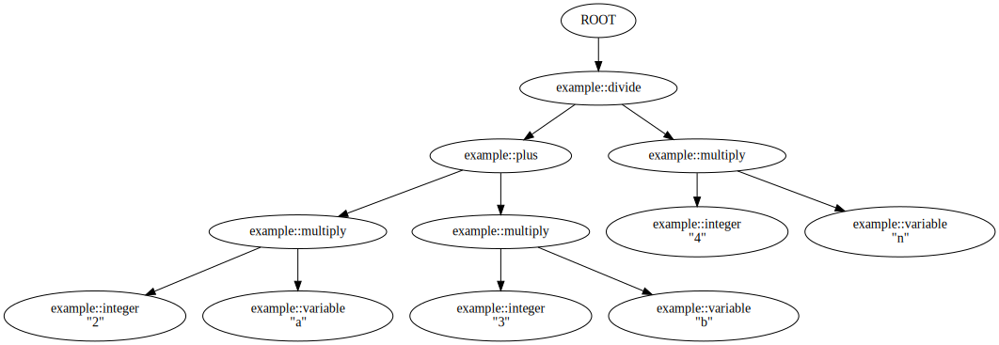

# Example Reference

The reference documentation for the included example grammars and programs.


## Contents

* [Preamble](#preamble)
* [Grammars](#grammars)
* [Programs](#programs)
* [Index](#index)


## Preamble

This page lists all included example gramamrs and programs.
The examples are not considered part of the public interface subject to semantic versioning.


## Grammars

The example grammars reside in [`include/tao/pegtl/example/`](../include/tao/pegtl/example).

###### [`abnf_abnf.hpp`](../include/tao/pegtl/example/abnf_abnf.hpp)

Grammar for ABNF rules according to Section 4 of [RFC 5234](https://tools.ietf.org/html/rfc5234) as updated by [RFC 7405](https://tools.ietf.org/html/rfc7405).

 * Extended with PEG 'and' and 'not' predicates.
 * Modified to not allow C++ keywords as rule names.

###### [`abnf_core.hpp`](../include/tao/pegtl/example/abnf_core.hpp)

Rules for the ABNF core rules according to Appendix B.1 of [RFC 5234, Appendix B](https://tools.ietf.org/html/rfc5234).

###### [`escaped.hpp`](../include/tao/pegtl/example/escaped.hpp)

Rules for escape sequences in C and JSON strings ready for the [unescape actions](Extra-Reference.md#unescapehpp).

###### [`fp.hpp`](../include/tao/pegtl/example/fp.hpp)

A grammar for the textual representation of floating point numbers, suitable for `std::stod()` (without locale support).

###### [`http.hpp`](../include/tao/pegtl/example/http.hpp)

HTTP 1.1 grammar according to [RFC 7230](https://tools.ietf.org/html/rfc7230).

###### [`integer.hpp`](../include/tao/pegtl/example/integer.hpp)

Various rules for the textual representation of integer values; the old `include/tao/pegtl/contrib/integer.hpp` is now `include/tao/pegtl/deprecated/integer.hpp`.

###### [`iri.hpp`](../include/tao/pegtl/example/iri.hpp)

IRI grammar according to [RFC 3987](https://tools.ietf.org/html/rfc3987).

###### [`json.hpp`](../include/tao/pegtl/example/json.hpp)

JSON grammar according to [RFC 7159](https://tools.ietf.org/html/rfc7159) (UTF-8 only).

###### [`json_pointer.hpp`](../include/tao/pegtl/example/json_pointer.hpp)

JSON pointer grammar according to [RFC 6901](https://tools.ietf.org/html/rfc6901) (UTF-8 only).

###### [`lua53.hpp`](../include/tao/pegtl/example/lua53.hpp)

Grammar for the [Lua](https://lua.org) [5.3](https://lua.org/manual/5.3/) scripting language that combines lexer and parser.

###### [`proto3.hpp`](../include/tao/pegtl/example/proto3.hpp)

Grammar for [Protocol Buffers (Proto3)](https://developers.google.com/protocol-buffers/docs/reference/proto3-spec).

###### [`semver2.hpp`](../include/tao/pegtl/example/semver2.hpp)

Grammar for [SemVer Versions 2.0.0](https://semver.org/#backusnaur-form-grammar-for-valid-semver-versions).

###### [`uri.hpp`](../include/tao/pegtl/example/uri.hpp)

URI grammar according to [RFC 3986](https://tools.ietf.org/html/rfc3986).


## Programs

The example programs can be found in [`src/example/`](../src/example).

###### [`abnf2pegtl.cpp`](../src/example/abnf2pegtl.cpp)

Parses [ABNF (RFC 5234)](https://tools.ietf.org/html/rfc5234)-style grammars with the [ABNF grammar](#abnfpp) and converts them into C++ PEGTL rules.
Uses the command line arguments as files to parse.
Some extensions and restrictions compared to RFC 5234:

 * As we are defining PEGs, the alternations are now ordered (`sor<>`).
 * The *and*- and *not*-predicates from PEGs have been added as `&` and `!`, respectively.
 * A single LF is also accepted as line ending.
 * C++ identifiers are formed by replacing the dashes in rulenames with underscores.
 * Reserved identifiers (keywords, ...) are rejected.
 * Numerical values must fit into the corresponding C++ data type.

###### [`abnf_record.cpp`](../src/example/abnf_record.cpp)

Shows how to create a linearized [record](TODO) of a parsing run with the [ABNF grammar](#abnfhpp).
Uses the command line arguments as files to parse.

```
$ build/bin/example/abnf_record src/example/abnf.abnf
tao::pegtl::abnf::rulename@4:1(93) 'rulelist'
tao::pegtl::digit@4:19(111) '1'
tao::pegtl::abnf::rulename@4:23(115) 'rule'
...
```

###### [`analyze.cpp`](../src/example/analyze.cpp)

A small example that provokes the [grammar analysis](Grammar-Analysis.md) to find problems.

###### [`calculator.cpp`](../src/example/calculator.cpp)

A calculator with all binary operators from the C language that shows

* how to use stack-based actions to perform a calculation on-the-fly during the parsing run, and
* how to build a grammar with a run-time data structure for arbitrary binary operators with arbitrary precedence and associativity.

In addition to the binary operators, round brackets can be used to change the evaluation order. The implementation uses `long` integers as data type for all calculations.

```sh
$ build/src/example/calculator "2 + 3 * -7"  "(2 + 3) * 7"
-19
35
```

In this example the grammar takes a bit of a second place behind the infrastructure for the actions required to actually evaluate the arithmetic expressions.
The basic approach is "shift-reduce", which is very close to a stack machine, which is a model often well suited to PEGTL grammar actions:
Some actions merely push something onto a stack, while other actions apply some functions to the objects on the stack, usually reducing its size.

###### [`chomsky_hierarchy.cpp`](../src/example/chomsky_hierarchy.cpp)

Examples of grammars for regular, context-free, and context-sensitive languages.

###### [`csv1.cpp`](../src/example/csv1.cpp)
###### [`csv2.cpp`](../src/example/csv2.cpp)

Two simple examples for grammars that parse different kinds of [CSV-style](https://en.wikipedia.org/wiki/Comma-separated_values) file formats.

###### [`hello_world.cpp`](../src/example/hello_world.cpp)

The reverse "hello world" example from the [introduction](Introduction.md).

###### [`indent_aware.cpp`](../src/example/indent_aware.cpp)

Shows one approach to implementing an indentation-aware language with a very very small subset of Python.

###### [`json_analyze.cpp`](../src/example/json_analyze.cpp)

Performs a grammar analysis on the JSON [grammar](Example-Reference.md#jsonhpp) to check for problems.

###### [`json_ast.cpp`](../src/example/json_ast.cpp)

TODO

###### [`json_build.cpp`](../src/example/json_build.cpp)

Extends on `json_parse.cpp` by parsing JSON files into generic JSON data structure.

###### [`json_count.cpp`](../src/example/json_count.cpp)

Shows how to use a simple custom control to create some parsing statistics while parsing JSON files.

###### [`json_coverage.cpp`](../src/example/json_coverage.cpp)

TODO

###### [`json_parse.cpp`](../src/example/json_parse.cpp)

Shows how to use the custom error messages defined in `json_errors.hpp` with the JSON [grammar](Example-Reference.md#jsonhpp) to parse command line arguments as JSON data.

###### [`json_print_debug.cpp`](../src/example/json_print_debug.cpp)

TODO

###### [`json_print_names.cpp`](../src/example/json_print_names.cpp)

TODO

###### [`json_record.cpp`](../src/example/json_record.cpp)

TODO

###### [`json_stream.cpp`](../src/example/json_stream.cpp)

TODO

###### [`json_tokens.cpp`](../src/example/json_tokens.cpp)

TODO

###### [`json_trace.cpp`](../src/example/json_trace.cpp)

TODO

###### [`lua53_analyze.cpp`](../src/example/lua53_analyze.cpp)

Performs a grammar analysis on the [Lua](https://www.lua.org/) [5.3](https://www.lua.org/manual/5.3/ [grammar](Example-Reference.md#lua53hpp) to check for problems.

###### [`lua53_parse.cpp`](../src/example/lua53_parse.cpp)

Parses [Lua](https://www.lua.org/) [5.3](https://www.lua.org/manual/5.3/) source files with the [combined experimental Lua grammar](Example-Reference.md#lua53hpp).
Uses the command line arguments as files to parse.

###### [`modulus_match.cpp`](../src/example/modulus_match.cpp)

Shows how to [implement a parsing rule from scratch](Rules-and-Grammars.md#implementing-rules), in this case using the [simplified calling convention](Rules-and-Grammars.md#simple-match).
Parses its command line arguments.

```
$ build/bin/example/modulus_match a b c
   'a' is NOT a match
   'b' is NOT a match
   'c' is a match
```

###### [`parse_tree.cpp`](../src/example/parse_tree.cpp)

An example for how to create a parse tree using [`<tao/pegtl/contrib/parse_tree.hpp>`](Parse-Tree.md) with a simple expression grammar.

The example shows how to choose which rules will produce a parse tree node, which rules will store the content, and how to add additional transformations to the parse tree to transform it into an AST-like structure or to simplify it.

The output is in [DOT](https://en.wikipedia.org/wiki/DOT_(graph_description_language)) format and can be converted into a graph.

```sh
$ build/src/example/parse_tree "(2*a + 3*b) / (4*n)" | dot -Tsvg -o parse_tree.svg
```

The above will generate an SVG file with a graphical representation of the parse tree.



###### [`proto3_analyze.cpp`](../src/example/proto3_analyze.cpp)

Performs a grammar analysis on the [Protocol Buffers (proto 3) grammar](#proto3hpp) to check for problems.

###### [`proto3_parse.cpp`](../src/example/proto3_parse.cpp)

Shows how to parse [Protocol Buffers](https://protobuf.dev/programming-guides/proto3/) files with the [Protocol Buffers (proto 3) grammar](#proto3hpp).
Uses the command line arguments as files to parse.

###### [`recover.cpp`](../src/example/recover.cpp)

An experiment in recovering from parse failures, see [PEGTL issue 55](https://github.com/taocpp/PEGTL/issues/55) and the source code for a description.

###### [`s_expression.cpp`](../src/example/s_expression.cpp)

Defines a simplified S-expression grammar TODO
Parses its command line arguments.

###### [`semver2_parse.cpp`](../src/example/semver2_parse.cpp)

Shows the [SemVer Version grammar](#semver2hpp) in action.
Parses its command line arguments.

###### [`sum.cpp`](../src/example/sum.cpp)

Shows how to add comma-separated lists of floating-point numbers taken from `std::cin`.

```
$ echo "1, 2, 3.14159, 42e3" | build/bin/example/sum
Give me a comma separated list of numbers.
The numbers are added using the PEGTL.
Type [q or Q] to quit

parsing OK; sum = 42006.14159
```

###### [`symbol_table.cpp`](../src/example/symbol_table.cpp)

Shows how to parse and store integers in a simple symbol table.
Each symbol needs to be defined before it is assigned to.
Uses the command line arguments as files to parse.

```
$ cat /tmp/ramdisk/symbol_table.txt
def foo;
def bar;
foo = 42;
bar = 23;
$ build/bin/example/symbol_table /tmp/ramdisk/symbol_table.txt
bar = 23
foo = 42
```

###### [`token_input_1.cpp`](../src/example/token_input_1.cpp)
###### [`token_input_2.cpp`](../src/example/token_input_2.cpp)

Show how to parse a sequence of tokens, rather than the usual sequence of `char`, where each token consists of an enum and a string.

###### [`unescape.cpp`](../src/example/unescape.cpp)

Uses the building blocks from `<tao/pegtl/contrib/unescape.hpp>` to show how to actually unescape a string literal with various typical escape sequences.
Parses its command line arguments.

```
$ build/bin/example/unescape 'X\x22Y' 'X\u0022Y' 'X\"Y'
argv[ 1 ] = X"Y
argv[ 2 ] = X"Y
argv[ 3 ] = X"Y
```

###### [`uri_print_debug.cpp`](../src/example/uri_print_debug.cpp)

Shows how to use `print_debug()` from `include/tao/pegtl/debug/print.hpp` to print all rules of the [URI grammar](#urihpp).

###### [`uri_print_names.cpp`](../src/example/uri_print_names.cpp)

Shows how to use `print_names()` from `include/tao/pegtl/debug/print.hpp` to print all rules of the [URI grammar](#urihpp).

###### [`uri_struct.cpp`](../src/example/uri_struct.cpp)

Shows how to use the [URI grammar](#urihpp) to parse a [URI](https://en.wikipedia.org/wiki/Uniform_Resource_Identifier) into a data structure.
Parses its command line arguments.

###### [`uri_trace.cpp`](../src/example/uri_trace.cpp)

Shows how to use `complete_trace` from `include/tao/pegtl/debug.trace.hpp` to parse a [URI](https://en.wikipedia.org/wiki/Uniform_Resource_Identifier) with a complete trace.
Parses its command line arguments.


## Index
* [`abnf_abnf.hpp`](#abnf_abnfhpp) <sup>[(grammar)](#grammars)</sup>
* [`abnf_core.hpp`](#anbf_corehpp) <sup>[(grammar)](#grammars)</sup>
* [`abnf2pegtl.cpp`](#abnf2pegtlcpp) <sup>[(program)](#programs)</sup>
* [`abnf_record.cpp`](#abnf_recordcpp) <sup>[(program)](#programs)</sup>
* [`analyze.cpp`](#analyzecpp) <sup>[(program)](#programs)</sup>
* [`behaviour.cpp`](#behaviourcpp) <sup>[(program)](#programs)</sup>
* [`calculator.cpp`](#calculatorcpp) <sup>[(program)](#programs)</sup>
* [`chomsky_hierarchy.cpp`](#chomsky_hierarchycpp) <sup>[(program)](#programs)</sup>
* [`csv_1.cpp`](#csv_1cpp) <sup>[(program)](#programs)</sup>
* [`csv_2.cpp`](#csv_2cpp) <sup>[(program)](#programs)</sup>
* [`dispatch.cpp`](#dispatchcpp) <sup>[(program)](#programs)</sup>
* [`dynamic_match.cpp`](#dynamic_matchcpp) <sup>[(program)](#programs)</sup>
* [`escaped.hpp`](#escapedhpp) <sup>[(grammar)](#grammars)</sup>
* [`expression.cpp`](#expressioncpp) <sup>[(program)](#programs)</sup>
* [`fp.hpp`](#fphpp) <sup>[(grammar)](#grammars)</sup>
* [`hello_world.cpp`](#hello_worldcpp) <sup>[(program)](#programs)</sup>
* [`http.hpp`](#httphpp) <sup>[(grammar)](#grammars)</sup>
* [`indent_aware.cpp`](#indent_awarecpp) <sup>[(program)](#programs)</sup>
* [`integer.hpp`](#integerhpp) <sup>[(grammar)](#grammars)</sup>
* [`iri.hpp`](#irihpp) <sup>[(grammar)](#grammars)</sup>
* [`iri_struct.cpp`](#iri_structcpp) <sup>[(program)](#programs)</sup>
* [`json.hpp`](#jsonhpp) <sup>[(grammar)](#grammars)</sup>
* [`json_analyze.cpp`](#json_analyzecpp) <sup>[(program)](#programs)</sup>
* [`json_ast.cpp`](#json_astcpp) <sup>[(program)](#programs)</sup>
* [`json_build.cpp`](#json_buildcpp) <sup>[(program)](#programs)</sup>
* [`json_count.cpp`](#json_countcpp) <sup>[(program)](#programs)</sup>
* [`json_coverage.cpp`](#json_coveragecpp) <sup>[(program)](#programs)</sup>
* [`json_parse.cpp`](#json_parsecpp) <sup>[(program)](#programs)</sup>
* [`json_pointer.hpp`](#json_pointer.hpp) <sup>[(grammar)](#grammars)</sup>
* [`json_print_debug.cpp`](#json_print_debugcpp) <sup>[(program)](#programs)</sup>
* [`json_print_names.cpp`](#json_print_namescpp) <sup>[(program)](#programs)</sup>
* [`json_record.cpp`](#json_recordcpp) <sup>[(program)](#programs)</sup>
* [`json_stream.cpp`](#json_streamcpp) <sup>[(program)](#programs)</sup>
* [`json_tokenize.cpp`](#json_tokenizecpp) <sup>[(program)](#programs)</sup>
* [`json_trace.cpp`](#json_tracecpp) <sup>[(program)](#programs)</sup>
* [`lua53.hpp`](#lua53hpp) <sup>[(grammar)](#grammars)</sup>
* [`lua53_analyze.cpp`](#lua53_analyzecpp) <sup>[(program)](#programs)</sup>
* [`lua53_parse.cpp`](#lua53_parsecpp) <sup>[(program)](#programs)</sup>
* [`modulus_match.cpp`](#modulus_matchcpp) <sup>[(program)](#programs)</sup>
* [`parse_tree.cpp`](#parse_treecpp) <sup>[(program)](#programs)</sup>
* [`parse_tree_user_state.cpp`](#parse_tree_user_statecpp) <sup>[(program)](#programs)</sup>
* [`proto3.hpp`](#proto3hpp) <sup>[(grammar)](#grammars)</sup>
* [`proto3_analyze.cpp`](#proto3_analyzecpp) <sup>[(program)](#programs)</sup>
* [`proto3_parse.cpp`](#proto3_parsecpp) <sup>[(program)](#programs)</sup>
* [`recover.cpp`](#recovercpp) <sup>[(program)](#programs)</sup>
* [`s_expression.cpp`](#s_expressioncpp) <sup>[(program)](#programs)</sup>
* [`semver2.hpp`](#semver2hpp) <sup>[(grammar)](#grammars)</sup>
* [`semver2_parse.cpp`](#semver2_parsecpp) <sup>[(program)](#programs)</sup>
* [`sum.cpp`](#sumcpp) <sup>[(program)](#programs)</sup>
* [`symbol_table.cpp`](#symbol_tablecpp) <sup>[(program)](#programs)</sup>
* [`token_input_1.cpp`](#token_input_1cpp) <sup>[(program)](#programs)</sup>
* [`token_input_2.cpp`](#token_input_2cpp) <sup>[(program)](#programs)</sup>
* [`unescape.cpp`](#unescapecpp) <sup>[(program)](#programs)</sup>
* [`uri.hpp`](#urihpp) <sup>[(grammar)](#grammars)</sup>
* [`uri_print_debug.cpp`](#uri_print_debugcpp) <sup>[(program)](#programs)</sup>
* [`uri_print_names.cpp`](#uri_print_namescpp) <sup>[(program)](#programs)</sup>
* [`uri_struct.cpp`](#uri_structcpp) <sup>[(program)](#programs)</sup>
* [`uri_trace.cpp`](#uri_tracecpp) <sup>[(program)](#programs)</sup>


---

This page is part of the [PEGTL](https://github.com/taocpp/PEGTL) and its [documentation](README.md).

Copyright (c) 2014-2026 Dr. Colin Hirsch and Daniel Frey<br>
Distributed under the Boost Software License, Version 1.0<br>
See accompanying file [LICENSE_1_0.txt](../LICENSE_1_0.txt) or copy at https://www.boost.org/LICENSE_1_0.txt
