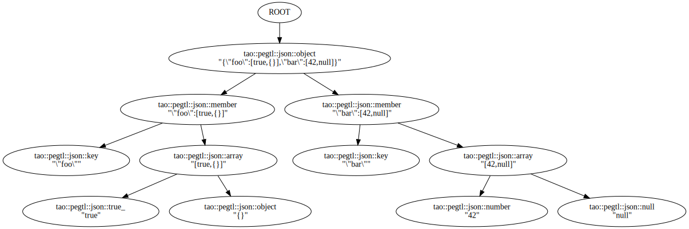

# Getting Started

Since the PEGTL is a parser library, here is an "inverse hello world" example that parses,
rather than prints, the string `Hello, foo!` for any sequence of alphabetic ASCII characters `foo`.

```c++
#include <string>
#include <iostream>

#include <tao/pegtl.hpp>

namespace pegtl = tao::pegtl;

namespace hello
{
   // Parsing rule that matches a literal "Hello, ".

   struct prefix
      : pegtl::string< 'H', 'e', 'l', 'l', 'o', ',', ' ' >
   {};

   // Parsing rule that matches a non-empty sequence of
   // alphabetic ascii-characters with greedy-matching.

   struct name
      : pegtl::plus< pegtl::alpha >
   {};

   // Parsing rule that matches a sequence of the 'prefix'
   // rule, the 'name' rule, a literal "!", and 'eof'
   // (end-of-file/input), and that throws an exception
   // on failure.

   struct grammar
      : pegtl::must< prefix, name, pegtl::one< '!' >, pegtl::eof >
   {};

   // Class template for user-defined actions that does
   // nothing by default.

   template< typename Rule >
   struct action
   {};

   // Specialisation of the user-defined action to do
   // something when the 'name' rule succeeds; is called
   // with the portion of the input that matched the rule.

   template<>
   struct action< name >
   {
      template< typename ParseInput >
      static void apply( const ParseInput& in, std::string& v )
      {
         v = in.string();
      }
   };

}  // namespace hello

int main( int argc, char* argv[] )
{
   if( argc > 1 ) {
      // Start a parsing run of argv[1] with the string
      // variable 'name' as additional argument to the
      // action; then print what the action put there.

      std::string name;

      pegtl::argv_input in( argv, 1 );
      pegtl::parse< hello::grammar, hello::action >( in, name );

      std::cout << "Good bye, " << name << "!" << std::endl;
   }
}
```

Assuming you are in the main directory of the PEGTL, the above source can be
found in the `src/example/pegtl/` directory. Compile the program with something like

```sh
$ g++ --std=c++17 -Iinclude src/example/pegtl/hello_world.cpp -o hello_world
```

and then invoke it as follows:

```sh
$ ./hello_world 'Hello, world!'
Good bye, world!
$ ./hello_world 'Hello, Colin!'
Good bye, Colin!
$ ./hello_world 'Howdy, Paula!'
terminate called after throwing an instance of 'tao::pegtl::parse_error'
  what():  argv[1]:1:0(0): parse error matching hello::prefix
Aborted (core dumped)
```

The PEGTL provides multiple facilities that help to get started and develop your grammar.
In the following paragraphs we will show several small programs to showcase the capabilities of the PEGTL.

Note, however, that all examples shown in this document will lack proper error handling.
Frequently an application will include `try-catch` blocks to handle the exceptions.
The correct way of handling errors is shown at the last paragraph of this page.

## Parsing Expression Grammars

The PEGTL creates parsers according to a [Parsing Expression Grammar](http://en.wikipedia.org/wiki/Parsing_expression_grammar) (PEG).

| PEG                               | `tao::pegtl::`                                                                                            |
| ---                               | ---                                                                                                       |
| &*e*                              | [`at< R... >`](Rule-Reference.md#at-r-) <sup>[(combinators)](Rule-Reference.md#combinators)</sup>         |
| !*e*                              | [`not_at< R... >`](Rule-Reference.md#not_at-r-) <sup>[(combinators)](Rule-Reference.md#combinators)</sup> |
| *e*?                              | [`opt< R... >`](Rule-Reference.md#opt-r-) <sup>[(combinators)](Rule-Reference.md#combinators)</sup>       |
| *e*+                              | [`plus< R... >`](Rule-Reference.md#plus-r-) <sup>[(combinators)](Rule-Reference.md#combinators)</sup>     |
| *e*<sub>1</sub>*e*<sub>2</sub>    | [`seq< R... >`](Rule-Reference.md#seq-r-) <sup>[(combinators)](Rule-Reference.md#combinators)</sup>       |
| *e*<sub>1</sub> / *e*<sub>2</sub> | [`sor< R... >`](Rule-Reference.md#sor-r-) <sup>[(combinators)](Rule-Reference.md#combinators)</sup>       |
| *e**                              | [`star< R... >`](Rule-Reference.md#star-r-) <sup>[(combinators)](Rule-Reference.md#combinators)</sup>     |

## Grammar Analysis

Every grammar must be free of cycles that make no progress, i.e. the cycle does not consume any input.
This is a common problem in parsing called [left recursion](https://en.wikipedia.org/wiki/Left_recursion).
Especially with the PEG formalism, it results in an infinite loop and, eventually, in a stack overflow.

The PEGTL provides a [grammar analysis](Grammar-Analysis.md) with which a grammar can be verified.
Note that this is done at runtime as a pure compile-time analysis would lead to insupportable compile-times.
The analysis, however, is only based on the grammar itself and not on a specific input.
Additionally, the analysis is typically written as a separate program to keep any overhead from your normal applications.

```c++
#include <tao/pegtl.hpp>
#include <tao/pegtl/contrib/analyze.hpp>

// This example uses the included JSON grammar
#include <tao/pegtl/contrib/json.hpp>

namespace pegtl = tao::pegtl;

using grammar = pegtl::must< pegtl::json::text, pegtl::eof >;

int main()
{
   if( pegtl::analyze< grammar >() != 0 ) {
      std::cerr << "cycles without progress detected!\n";
      return 1;
   }

   return 0;
}
```

## Tracer

One of the most basic tools when developing a grammar is a tracer that prints every step of a parsing run.
The PEGTL provides a tracer that will print to stderr, as well as allowing users to write their own tracers to output other formats.

```c++
#include <tao/pegtl.hpp>
#include <tao/pegtl/contrib/trace.hpp>

// This example uses the included JSON grammar
#include <tao/pegtl/contrib/json.hpp>

namespace pegtl = tao::pegtl;

using grammar = pegtl::must< pegtl::json::text, pegtl::eof >;

int main( int argc, char** argv )
{
   if( argc != 2 ) return 1;

   pegtl::argv_input in( argv, i );
   pegtl::standard_trace< grammar >( in );

   return 0;
}
```

In the above each command line parameter is parsed as a JSON string.
As the output gets long quickly, we will not show it here, please have a look at the [Tracer](Tracer.md) documentation.

TODO: Write `Tracer.md`.

## Parse Tree / AST

When developing grammars, a common goal is to generate a [parse tree](https://en.wikipedia.org/wiki/Parse_tree) or an [AST](https://en.wikipedia.org/wiki/Abstract_syntax_tree).

The PEGTL provides a [Parse Tree](Parse-Tree.md) builder that can filter and/or transform tree nodes on-the-fly.
Additionally, a helper is provided to print out the resulting data structure in the [DOT](https://en.wikipedia.org/wiki/DOT_(graph_description_language)) format, suitable for creating a graphical representation of the parse tree.

The following example uses a selector to filter the parse tree nodes, as otherwise the graphical representation may become confusing quite quickly.

```c++
#include <tao/pegtl.hpp>
#include <tao/pegtl/contrib/parse_tree.hpp>
#include <tao/pegtl/contrib/parse_tree_to_dot.hpp>

// This example uses the included JSON grammar
#include <tao/pegtl/contrib/json.hpp>

namespace pegtl = tao::pegtl;

using grammar = pegtl::must< pegtl::json::text, pegtl::eof >;

template< typename Rule >
using selector = pegtl::parse_tree::selector<
   Rule,
   pegtl::parse_tree::store_content::on<
      pegtl::json::null,
      pegtl::json::true_,
      pegtl::json::false_,
      pegtl::json::number,
      pegtl::json::string,
      pegtl::json::key,
      pegtl::json::array,
      pegtl::json::object,
      pegtl::json::member > >;

int main( int argc, char** argv )
{
   if( argc != 2 ) return 1;

   pegtl::argv_input in( argv, i );
   const auto root = parse_tree::parse< grammar, selector >( in );
   if( root ) {
      parse_tree::print_dot( std::cout, *root );
   }

   return 0;
}
```

Running the above program with some example input:

```sh
$ build/src/example/pegtl/json_parse_tree '{"foo":[true,{}],"bar":[42,null]}' | dot -Tsvg -o json_parse_tree.svg
```

The above will generate an SVG file with a graphical representation of the parse tree.



## Error Handling

Although the PEGTL could be used without exceptions, most programs will use input classes or grammars that might throw exceptions.
Typically, the following pattern helps to print the exceptions properly:

```c++
   // The surrounding try/catch for normal exceptions.
   // These might occur if a file can not be opened, etc.
   try {
      tao::pegtl::file_input in( filename );

      // The inner try/catch block, see below...
      try {

         // The actual parser, tracer, parse tree, ...
         pegtl::parse< grammar >( in );

      }
      catch( const pegtl::parse_error& e ) {

         // This catch block needs access to the input
         const auto p = e.positions().front();
         std::cerr << e.what() << '\n'
                   << in.line_at( p ) << '\n'
                   << std::setw( p.column ) << '^' << std::endl;

      }
   }
   catch( const std::exception& e ) {

      // Generic catch block for other exceptions
      std::cerr << e.what() << std::endl;

   }
```

For more information see [Errors and Exceptions](Errors-and-Exceptions.md).

Copyright (c) 2014-2020 Dr. Colin Hirsch and Daniel Frey
