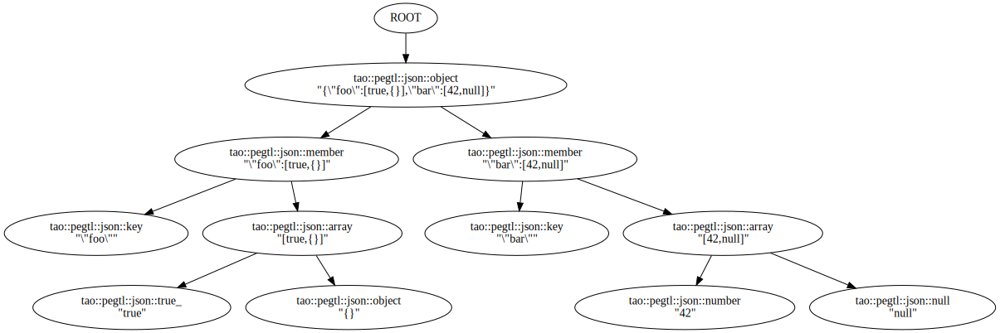

# Temporary File

## Failure Modes

The information about how much input is consumed by the rules only applies when the rules succeed.
Otherwise there are two failure modes with different requirements.

- *Local failure* is when a rule returns `false` and the rule **must** generally rewind the input to where its match attempt started.
- *Global failure* is when a rule throws an exception (usually of type `tao::pegtl::parse_error`)(usually via the control-class' `raise()` function).

Since an exception, by default, aborts a parsing run -- hence the term "global failure" -- there are no assumptions or requirements for the throwing rule to rewind the input.

On the other hand a local failure will frequently lead to back-tracking, i.e. the attempt to match a different rule at the same position in the input, wherefore rules that were previously attempted at the same position must rewind back to where they started in preparation of the next attempt.

Note that in some cases it is not necessary to actually rewind on local failure, see the description of the [rewind_mode](Rules-and-Grammars.md#modes) in the section on [how to implement custom rules](Rules-and-Grammars.md#creating-new-rules), and that the PEGTL attempts to minimise superfluous rewinding by statically detecting most of these cases.


Many of these rules can directly be applied to objects in the input, frequently of type `char`, but also to data members or the return values of global or member functions in cases where the input is a sequence of other types.

## Grammar Analysis

Every grammar must be free of cycles that make no progress, i.e. it must not contain unbounded recursive or iterative rules that do not consume any input, as such grammar might enter an infinite loop.
One common pattern for these kinds of problematic grammars is the "dreaded" [left recursion](https://en.wikipedia.org/wiki/Left_recursion) that, while not a problem for less deterministic formalisms like CFGs, must be avoided with PEGs in order to prevent aforementioned infinite loops.

The PEGTL provides a [grammar analysis](Grammar-Analysis.md) that searches the rules of a grammar for cycles that make no progress.
While this could probably be implemented with compile-time meta-programming the implementation in the PEGTL avoids excessive compile times by doing everything at run-time.
It is best practice to create a separate dedicated program that does nothing else but run the grammar analysis, thus keeping this development and debug aid out of the main application.

```c++
#include <tao/pegtl.hpp>
#include <tao/pegtl/analyze.hpp>

// For this example we use the included JSON grammar.

#include <tao/pegtl/contrib/json.hpp>

namespace pegtl = tao::pegtl;

using grammar = pegtl::must< pegtl::json::text, pegtl::eof >;

int main()
{
   if( pegtl::analyze< grammar >() != 0 ) {
      std::cerr << "Cycles without progress detected!" << std::endl;
      return 1;
   }
   return 0;
}
```
The full example can be found in `src/pegtl/json_analyze.cpp`.
For more information see [Grammar Analysis](Grammar-Analysis.md).

## Tracer

A fundamental tool for grammar development is a *tracer* that prints every step of a parsing run.
It shows exactly which rule was attempted to match where, and what the result was.
The PEGTL provides a tracer that serves both as practical debug tool and as example of the modular nature of the core library that allows for such facilities to be added.

```c++
#include <tao/pegtl.hpp>
#include <tao/pegtl/contrib/trace.hpp>

// This example uses the included JSON grammar
#include <tao/pegtl/contrib/json.hpp>

namespace pegtl = tao::pegtl;

using grammar = pegtl::must< pegtl::json::text, pegtl::eof >;

int main( int argc, char** argv )
{
   if( argc != 2 ) return 1;

   pegtl::argv_input in( argv, 1 );
   pegtl::standard_trace< grammar >( in );

   return 0;
}
```

In the example above, each command line parameter is parsed as a JSON string and a trace is printed to `stderr`.

The full example can be found in `src/pegtl/json_trace.cpp`.
For more information see `tao/pegtl/contrib/trace.hpp`.

## Parse Tree / AST

When developing parsers, a common goal after creating the grammar is to generate a [parse tree](https://en.wikipedia.org/wiki/Parse_tree) or an [AST](https://en.wikipedia.org/wiki/Abstract_syntax_tree).

The PEGTL provides a [Parse Tree](Parse-Tree.md) builder that can filter and/or transform tree nodes on-the-fly.
Additionally, a helper is provided to print out the resulting data structure in [DOT](https://en.wikipedia.org/wiki/DOT_(graph_description_language)) format, suitable for creating a graphical representation of the parse tree.

The following example uses a selector to choose which rules generate parse tree nodes, as the graphical representation will usually be too large and confusing when not using a filter and generating nodes for *all* rules.

```c++
#include <tao/pegtl.hpp>
#include <tao/pegtl/contrib/parse_tree.hpp>
#include <tao/pegtl/contrib/parse_tree_to_dot.hpp>

// This example uses the included JSON grammar
#include <tao/pegtl/contrib/json.hpp>

namespace pegtl = tao::pegtl;

using grammar = pegtl::must< pegtl::json::text, pegtl::eof >;

template< typename Rule >
using selector = pegtl::parse_tree::selector<
   Rule,
   pegtl::parse_tree::store_content::on<
      pegtl::json::null,
      pegtl::json::true_,
      pegtl::json::false_,
      pegtl::json::number,
      pegtl::json::string,
      pegtl::json::key,
      pegtl::json::array,
      pegtl::json::object,
      pegtl::json::member > >;

int main( int argc, char** argv )
{
   if( argc != 2 ) return 1;

   pegtl::argv_input in( argv, 1 );
   const auto root = parse_tree::parse< grammar, selector >( in );
   if( root ) {
      parse_tree::print_dot( std::cout, *root );
   }

   return 0;
}
```

Running the above program with some example input:

```sh
$ build/src/pegtl/json_parse_tree '{"foo":[true,{}],"bar":[42,null]}' | dot -Tsvg -o json_parse_tree.svg
```

The above will generate an SVG file with a graphical representation of the parse tree.



For more information see [Parse Tree](Parse-Tree.md).

## Error Handling

Although the PEGTL could be used without exceptions, most programs will use input classes, grammars and/or actions that can throw exceptions.
Typically, the following pattern helps to print the exceptions in a human friendly way:

```c++
   // The surrounding try/catch for normal exceptions.
   // These might occur if a file can not be opened, etc.
   try {
      tao::pegtl::file_input in( filename );

      // The inner try/catch block, see below...
      try {

         // The actual parser, tracer, parse tree, ...
         pegtl::parse< grammar >( in );

      }
      catch( const pegtl::parse_error& e ) {

         // This catch block needs access to the input
         const auto& p = e.positions_object();
         std::cerr << e.what() << '\n'
                   << tao::pegtl::line_view_at( in, p ) << '\n'
                   << std::setw( p.column ) << '^' << std::endl;

      }
   }
   catch( const std::exception& e ) {

      // Generic catch block for other exceptions
      std::cerr << e.what() << std::endl;

   }
```

For more information see [Errors and Exceptions](Errors-and-Exceptions.md).


---

This page is part of the [PEGTL](https://github.com/taocpp/PEGTL) and its [documentation](README.md).

Copyright (c) 2014-2025 Dr. Colin Hirsch and Daniel Frey<br>
Distributed under the Boost Software License, Version 1.0<br>
See accompanying file [LICENSE_1_0.txt](../LICENSE_1_0.txt) or copy at https://www.boost.org/LICENSE_1_0.txt
